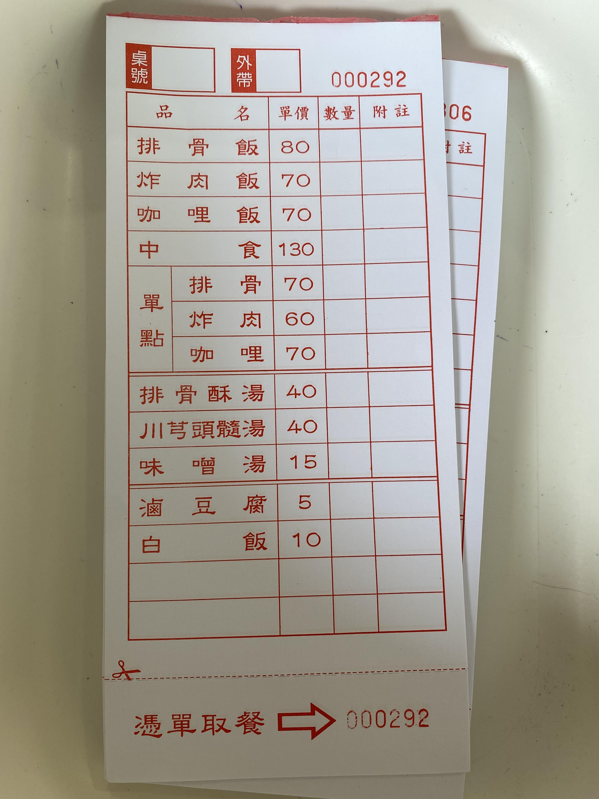

# Restaurant-Website


## About The Project

<p align="center">
  
</p>

This project is designed to assist long-established restaurants in their digital transformation, with a focus on reducing single-use utensil consumption. The project covers several key areas:

**Restaurant Website**: A custom website showcasing menus, hours, and announcements, strengthening brand awareness and connecting with customers.

**Raw Material Price API**: A real-time API that allows restaurant managers to track ingredient prices and make informed purchasing decisions based on up-to-date market data, ensuring cost efficiency.

**Customized Online Store Template**: A tailored online ordering platform that can be configured to meet specific needs, enabling restaurants to track and manage online orders while enhancing customer convenience.

**Reducing Single-Use Utensils**: The website encourages customers to choose reusable options and raises awareness about sustainability, helping restaurants achieve eco-friendly goals.

This solution is built primarily with Next.js and hosted on Vercel to ensure high performance and scalability. Cloud MongoDB supports the backend, storing user data, order history, and ingredient prices, making data management and expansion secure and efficient.

Overall, this digital transformation solution not only enhances operational efficiency but also promotes sustainability, reducing waste and supporting environmentally-conscious practices.

## Prerequisites

Before you get started, make sure you have the following installed:

1. Node.js
- **Version**: You should have Node.js version 10.13 or later installed. It’s generally recommended to use the latest LTS (Long Term Support) version for better stability and performance.
- **Installation**: You can download Node.js from the official website or use a package manager like Homebrew for macOS or Chocolatey for Windows.
2. npm or Yarn
- **Package Manager**: npm (comes with Node.js) or Yarn (an alternative package manager). Either can be used to manage your project dependencies.
- **Installation**: If you have Node.js installed, npm is included. Yarn can be installed globally via npm with the command:
    ```bash
    npm install --global yarn
    ```

## Getting Started

1. **Clone the Repository**:
    ```bash
    git clone https://github.com/yeejiac/restuarant-webservice.git
    cd restaurant-website
    git submodule update --init --recursive
    ```

2. **Build the Project**:
    ```bash
    npm run build
    ```

3. **Set the Config file**:
    ```bash
    # Create a .env.local file under project directory
    LINE_PAY_CHANNEL_ID=YOUR_CHANNEL_ID
    LINE_PAY_CHANNEL_SECRET=YOUR_CHANNEL_SECRET
    LINE_PAY_API_URL=https://sandbox-api-pay.line.me/v2/payments/request
    LINE_PAY_CONFIRM_URL=https://sandbox-api-pay.line.me/v2/payments/
    YOUR_SITE_URL=https://yourwebsite.com
    API_KEY=1234
    ```

4. **Run the development server**:
    ```bash
    npm run dev
    # or
    yarn dev
    # or
    pnpm dev
    # or
    bun dev
    ```
    Open [http://localhost:3000](http://localhost:3000) with your browser to see the result.
